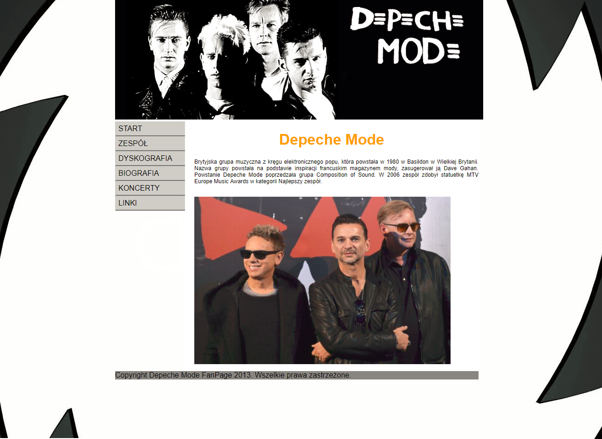
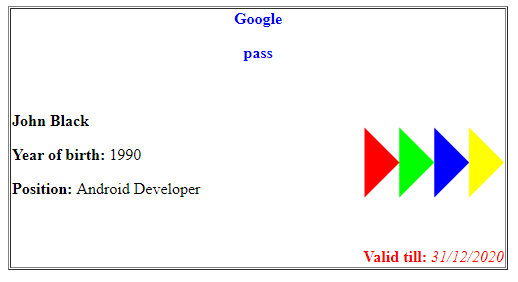

# IT-Tools-Exercises
Simple website and pass printer into files. Created at the University as the excercise within IT Tools classes in 2013. The purpose of those tasks was to create simple HTML website and learn files structure.

## Website
Simple website example uses only HTML and CSS. This website is about Depeche Mode band and is located in [site](site) folder.  

## Pass printer
Program for generating simple pass in HTML, PS, RTF formats.

